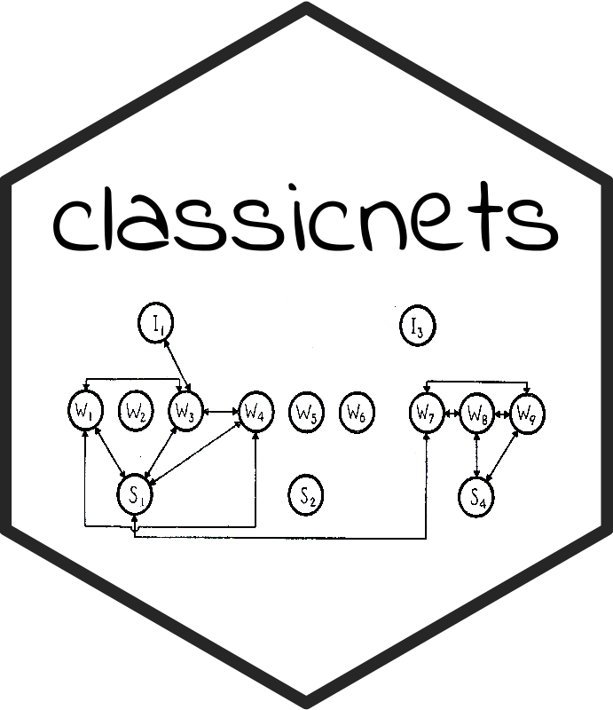
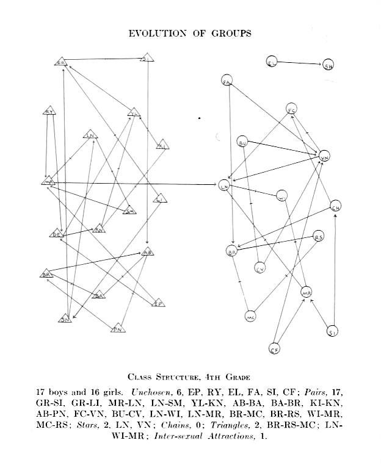
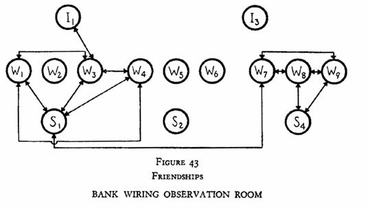
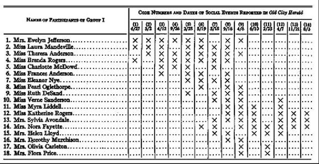
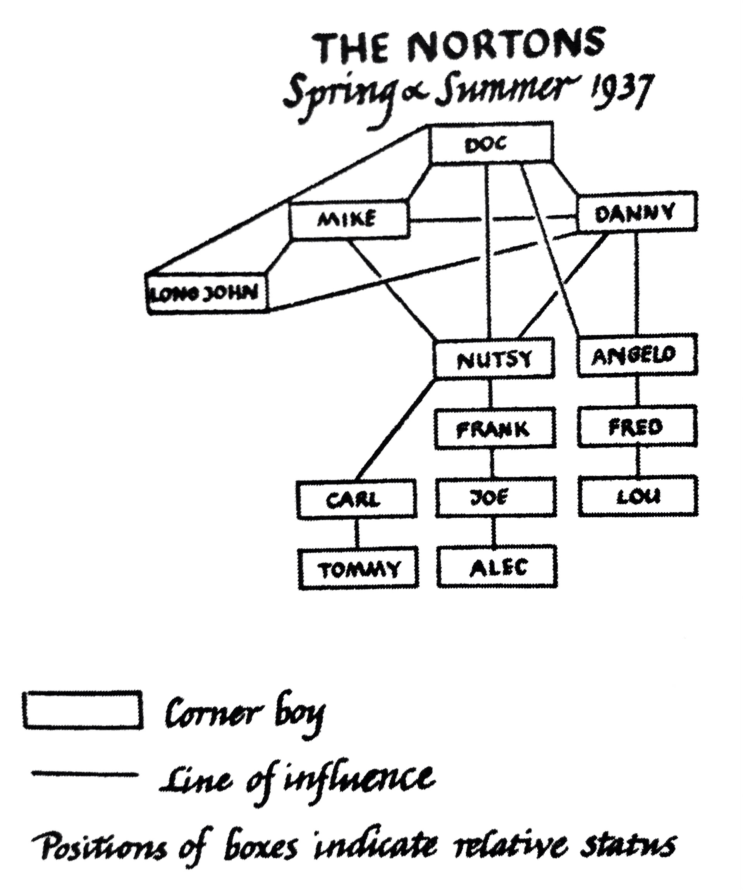
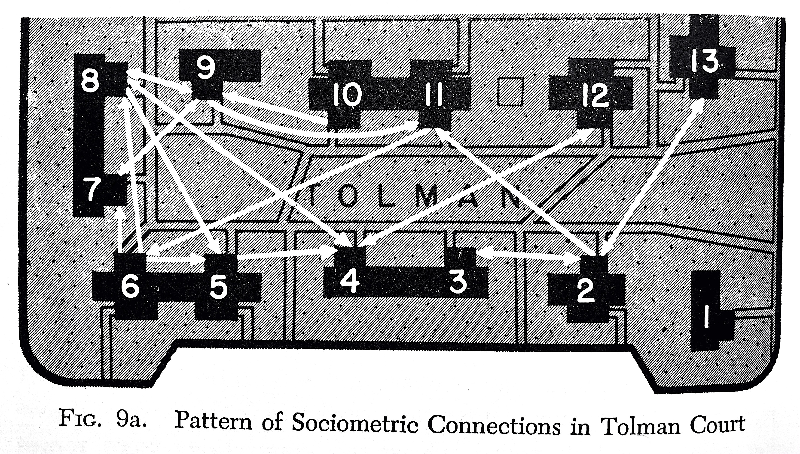
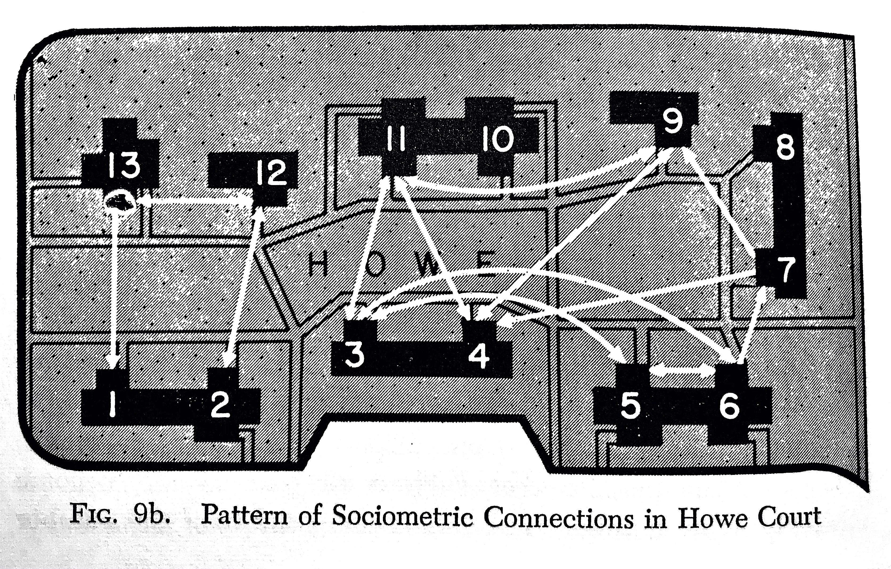
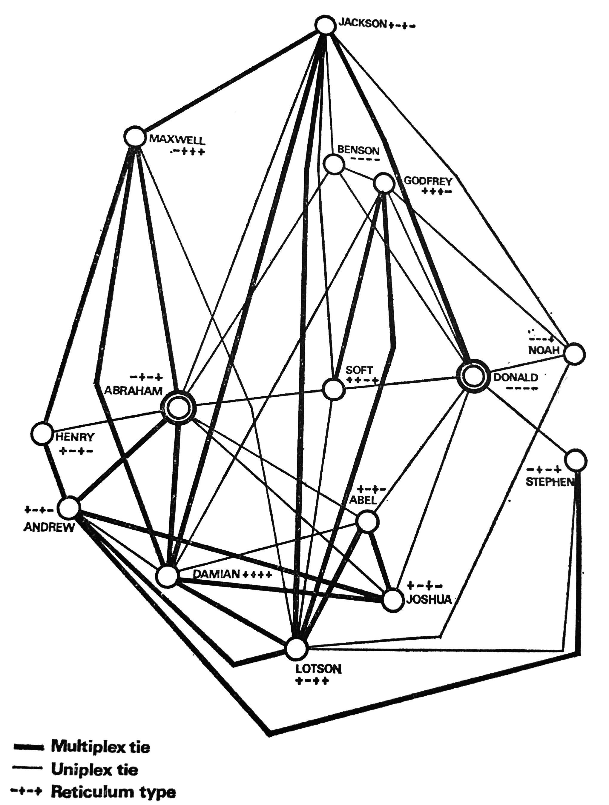
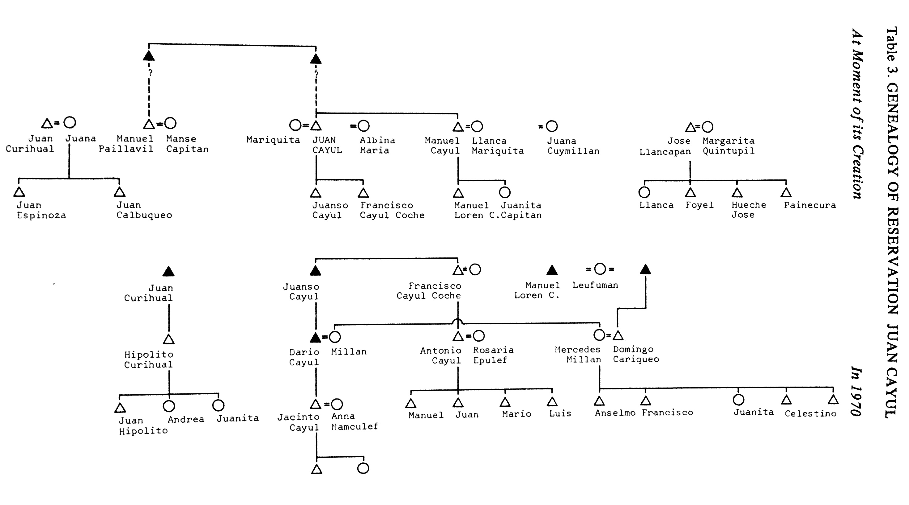
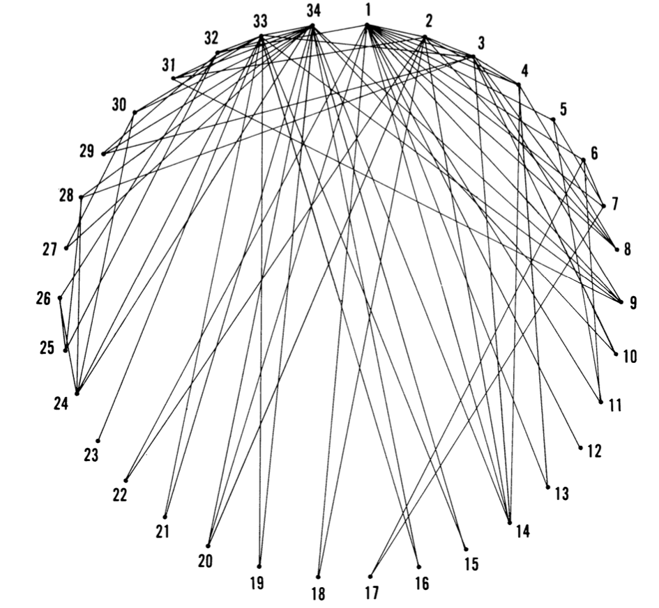

<!-- README.md is generated from README.Rmd. Please edit that file -->

```{r, include = FALSE}
knitr::opts_chunk$set(
  collapse = TRUE,
  comment = "#>",
  fig.path = "man/figures/README-",
  out.width = "100%"
)
```


<!-- badges: start -->
[](https://CRAN.R-project.org/package=classicnets)
[](https://www.tidyverse.org/lifecycle/#experimental)
[](https://www.gnu.org/licenses/gpl-3.0)
<!-- badges: end -->

# classicnets: Classic Data of Social Networks 

The goal of `classicnets` is to make available, compile and conserve classic data of social networks. We follow the history of this perspective based on [Linton Freeman](https://books.google.co.uk/books/about/The_Development_of_Social_Network_Analys.html?id=VcxqQgAACAAJ&redir_esc=y), [John Scott](https://link.springer.com/article/10.1007/s13278-010-0012-6) and reviews from [Ibero-America](https://chisocnet.org/social-network-in-ibero-america/). The data are in the classic `matrix` format. 

`r emo::ji("pen")` Author/mantainer: [Alejandro Espinosa-Rada](https://www.research.manchester.ac.uk/portal/en/researchers/alejandro-espinosa(4ed72800-e02b-47a8-a958-640b6a07f563).html) 

- [](https://twitter.com/aespinosarada)
- `r emo::ji("school")` [Social Networks Lab](https://sn.ethz.ch), ETH Zürich

`r emo::ji("pen")` Author/mantainer: [Francisca Ortiz](https://www.research.manchester.ac.uk/portal/francisca.ortiz.html)

- [](https://twitter.com/FranciscaOrtizR)
- `r emo::ji("school")` [The Mitchell Centre for Social Network Analysis](https://www.socialsciences.manchester.ac.uk/mitchell-centre/), The University of Manchester
- `r emo::ji("school")` [Millennium Institute for Caregiving Research (MICARE)](https://www.micare.cl)

-----

## Social Networks Available

You can install the development version from GitHub with:

```{r, eval=FALSE}
# install.packages("devtools")
devtools::install_github("anespinosa/classicnets")
```

```{r}
library(classicnets)
```

### Friendship choices among pupils

Moreno, Jacob L. (1934). Who Shall Survive? Washington, DC: Nervous and Mental Disease Publishing Company.

```{r}
data("pupils_classroom")
```



### Western Electric Company

Roethlisberger, Fritz Jules and Dickson, William John (1939). Management and the worker. An Account of a Research Program Conducted by the Western Electric Company, Hawthorne Works, Chicago. Harvard University Press: Cambridge, Massachusetts.

```{r, results='hide'}
data("bank_room")
matrix_to_edgelist(bank_room$friendship, digraph = TRUE)
```



### Southern Women

Davis, Allison; Gardner, Burleigh B. and Mary. R. Gardner (1941). Deep South: A Social Anthropological Study of Caste and Class. The University of Chicago Press, Chicago.

```{r}
data("southern_women")
```



### Corner Boys

Whyte, Willian Foote (1993[1943]). Street corner society. The social structure of an italian slum. Chicago, United States: The University of Chicago Press.

```{r}
data("corner_boys")
data("informalorg_corneville")
```



### Tolman and Howe Courts

Festinger, Leon, Stanley, Schachter and Back, Kurt (1950). Social pressures in informal groups. A study of human factors in housing. California, United States: Stanford University Press.

```{r}
data("tolman_court")
data("howe_court")
```




### Dispute of Worker of a Miner

Kapferer, Bruce (1969). Norms and the manipulation of relationships in a work context. In J Mitchell (ed), Social networks in urban situations. Manchester:  Manchester University Press.

```{r}
data("miner_dispute")
```



### Mapuches in Coipuco

Stuchlik, Milan (1976). The life on half share. Mechanisms of Social Recruitment among the Mapuche of Southern Chile. London: C. Hurst & Company.

```{r}
data("kin_mapuche")
data("labor_mapuche")
data("informalhelp_mapuche")
data("participation_mapuche")
```



### Karate Club

Zachary, Wayne W. (1977). An information flow model for conflict and fission in small groups. Journal of Anthropological Research, 33(4), 452-473.

```{r}
data("karate_club")
```



### The Electronic Information Exchange System 

- Freeman, S.C., Freeman, L.C. (1979). The networkers network: A study of the impact of a new communications medium on sociometric structure. Social Science Research Reports 46. University of California, Irvine, CA.
- Freeman, L.C., and Freeman, S.C. (1980). A semi-visible college: Structural effects on a social networks group. In Henderson, M.M., and McNaughton, M.J. (eds.) Electronic Communication: Technology and Impacts Boulder (pp. 77-85), CO: Westview Press

```{r}
data("eies")
```

-----

## Social Network Data

There are other excellent R packages for other and in some cases more comprehensive datasets such as: 

 - [`igraphdata`](https://github.com/igraph/igraphdata)
 - [`networkdata`](https://github.com/schochastics/networkdata)

 Other repositories (list created by participants of the conference [`Networks 2021: A Joint Sunbelt and NetSci Conference`](https://networks2021.net)):

 - [UCINET](http://www.analytictech.com/archive/ucinet.htm)
 - [PAJEK](http://vladowiki.fmf.uni-lj.si/doku.php?id=pajek:data:index)
 - [Konect Project](http://konect.cc/)
 - [Netzschleuder](https://networks.skewed.de)
 - [Connections](https://www.exeley.com/journal/connections)
 - [Gephi](https://github.com/gephi/gephi/wiki/Datasets)
 - [snap](http://snap.stanford.edu/data/index.html)
 - [icon](https://icon.colorado.edu/#!/networks)
 - [networkrepository](https://networkrepository.com/)
 - [Voter Fraud](https://voterfraud2020.io/)
 - [Twitter Politicians](http://twitterpoliticians.org/)
 - [Sociopatterns](http://www.sociopatterns.org/datasets/)
 - [Kdnuggets](https://www.kdnuggets.com/2015/04/awesome-public-datasets-github.html)
 - [Awesome Network Analysis](https://github.com/briatte/awesome-network-analysis)
 - [Microsoft Academic](https://www.microsoft.com/en-us/research/project/microsoft-academic-graph/)
 - [Datacommons](https://datacommons.org/)
 - [figshare](https://figshare.com/articles/dataset/United_States_Commutes_and_Megaregions_data_for_GIS/4110156)
 - [kaggle](https://www.kaggle.com/datasets?search=social+networks)
 - [ConcISE](https://github.com/IDIASLab/CONcISE)
 - [Alec's Project Documentation](http://wiki.alecmcgail.com/networkdatasets) 

-----

## Notes

- Please report any missing sources/references for datasets.

- Many datasets were manually gathered and may in this manner contain blunders. On the off chance that you detect any, please report them. 

- Double check the original source for any irregularities if you need to use the information in an academic paper.

-----

## Code of conduct

Please note that this project is released with a [Contributor Code of Conduct](https://anespinosa.github.io/netmem/CODE_OF_CONDUCT.html). By participating in this project you agree to abide by its terms.

-----
