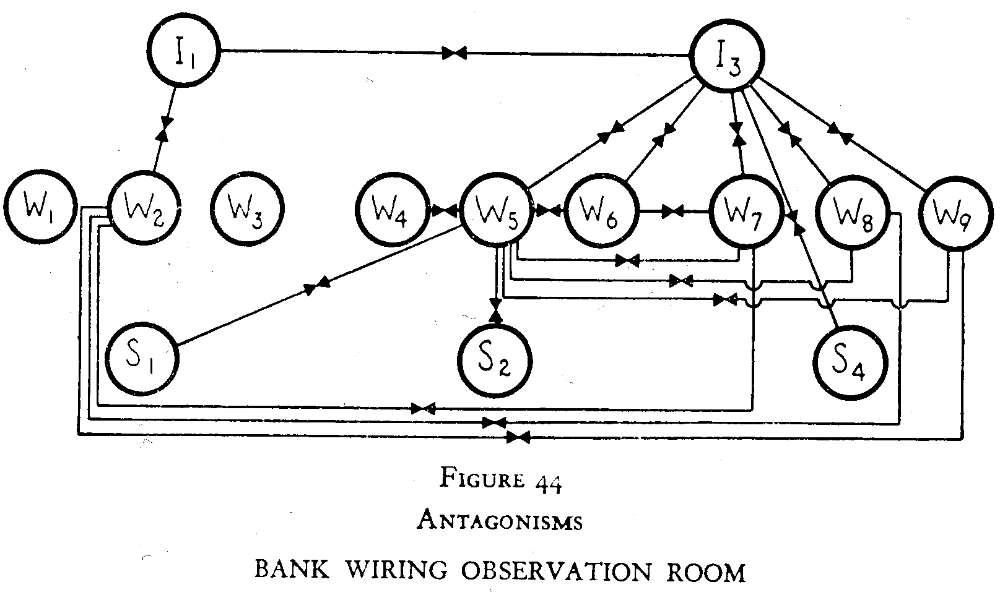

<!-- README.md is generated from README.Rmd. Please edit that file -->

```{r, include = FALSE}
knitr::opts_chunk$set(
  collapse = TRUE,
  comment = "#>",
  fig.path = "man/figures/README-",
  out.width = "100%"
)
```

<!-- badges: start -->
[](https://CRAN.R-project.org/package=classicnets)
[](https://www.tidyverse.org/lifecycle/#experimental)
[](https://www.gnu.org/licenses/gpl-3.0)
<!-- badges: end -->

# classicnets: Classic Data of Social Networks

The goal of `classicnets` is to make available, compile and conserve classic data of social networks that are rarely available. We follow a history of this perspective based on [Linton Freeman](https://books.google.co.uk/books/about/The_Development_of_Social_Network_Analys.html?id=VcxqQgAACAAJ&redir_esc=y), [John Scott](https://link.springer.com/article/10.1007/s13278-010-0012-6) and reviews from [Ibero-America](https://chisocnet.org/social-network-in-ibero-america/). The data are in the classic `matrix` format. 

`r emo::ji("pen")` Author/mantainer: [Alejandro Espinosa-Rada](https://www.research.manchester.ac.uk/portal/en/researchers/alejandro-espinosa(4ed72800-e02b-47a8-a958-640b6a07f563).html) 

[](https://twitter.com/aespinosarada)

`r emo::ji("pen")` Author/mantainer: [Francisca Ortiz](https://www.research.manchester.ac.uk/portal/francisca.ortiz.html)

[](https://twitter.com/FranciscaOrtizR)

`r emo::ji("school")` [The Mitchell Centre for Social Network Analysis](https://www.socialsciences.manchester.ac.uk/mitchell-centre/), The University of Manchester

-----

## Social Networks Available

```{r}
library(classicnets)
```


### Western Electric Company

Davis, Allison; Gardner, Burleigh B. and Mary. R. Gardner (1941). Deep South: A Social Anthropological Study of Caste and Class. The University of Chicago Press, Chicago.

```{r}
data("bank_room")
```



### Southern Women

Roethlisberger, Fritz Jules and Dickson, William John (1939). Management and the worker. An Account of a Research Program Conducted by the Western Electric Company, Hawthorne Works, Chicago. Harvard University Press: Cambridge, Massachusetts.

```{r}
data("southern_women")
```


-----

## Social Network Data

There are other excellent R packages for more comprehensive data such as [`networkdata`](https://github.com/schochastics/networkdata).


-----

## Notes

- Please report any missing sources/references for datasets.

- Many datasets were manually gathered and may in this manner contain blunders. On the off chance that you detect any, please report them. 

- Double check the original source for any irregularities if you need to use the information in an academic paper.

-----

## Code of conduct

Please note that this project is released with a [Contributor Code of Conduct](https://anespinosa.github.io/netmem/CODE_OF_CONDUCT.html). By participating in this project you agree to abide by its terms.

-----
